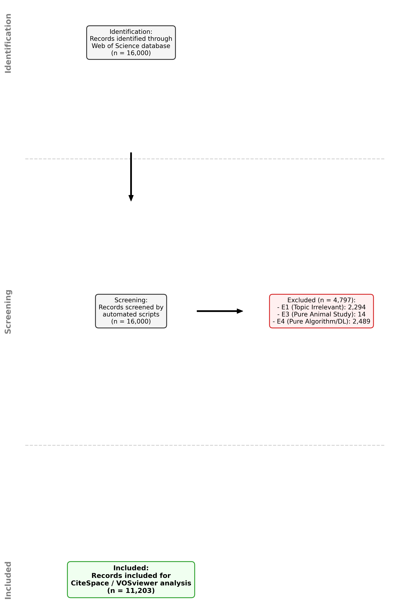
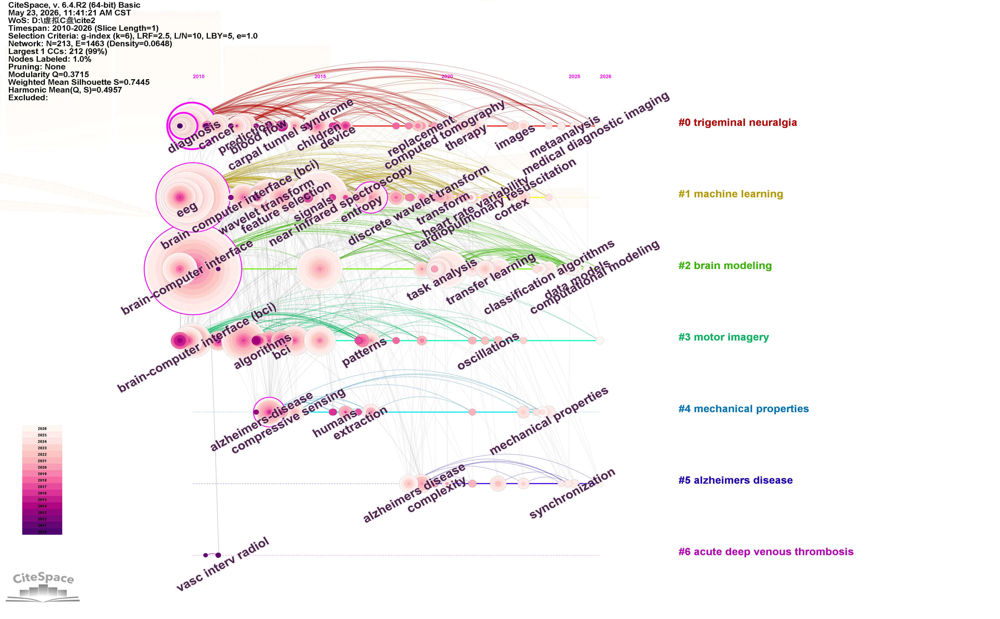
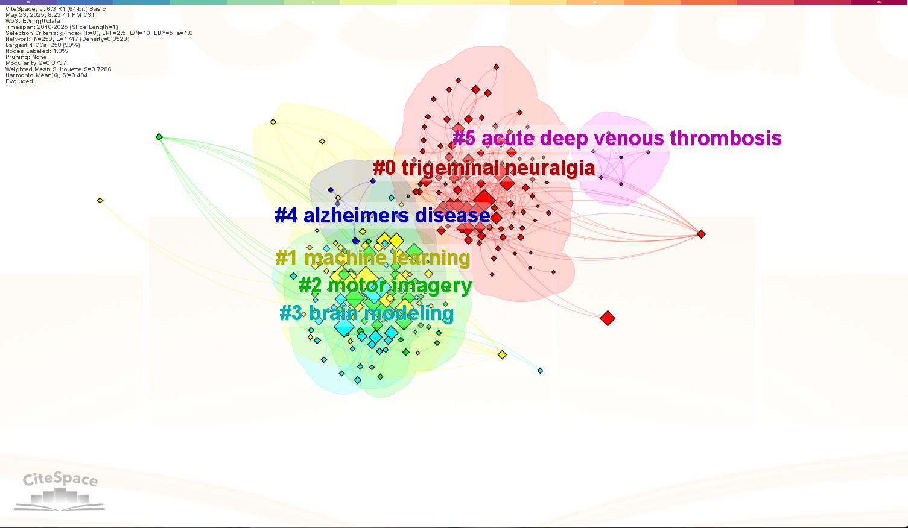
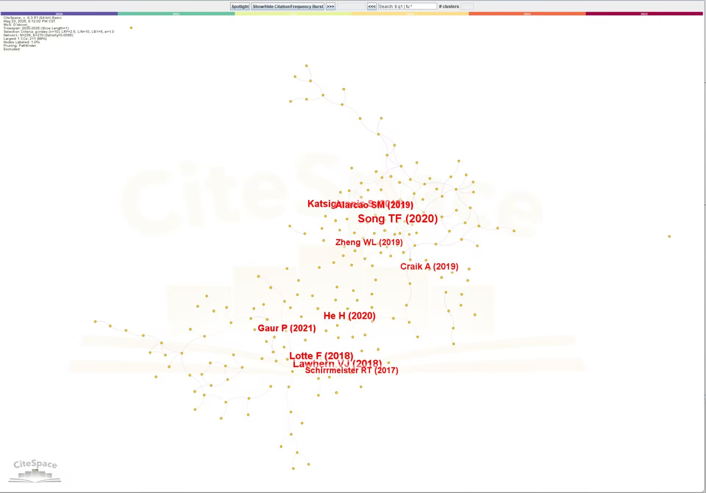

# 全植入式脑电信号与信息压缩系统的文献计量与系统化分析

## A Bibliometric and Systematic Analysis of Fully Implantable EEG Signal and Information Compression Systems

---

**摘要**　全植入式脑机接口（BCI）对脑电信号的采集、传输与压缩提出了严格的低功耗与高压缩率约束，然而现有综述缺乏对该领域知识结构、主题演化与前沿趋势的系统梳理。本文基于 Web of Science Core Collection 数据库，采用主题词与布尔逻辑组合检索策略获取 16,000 篇候选文献，经 PRISMA 标准四轮筛选后纳入 5,690 篇；运用 CiteSpace 进行关键词共现聚类、时间线演化与作者合作网络分析，结合自研 Python 证据链提取管线对电路架构、信号模态、功耗、压缩比、工艺制程与临床应用场景进行量化统计。结果表明，特征提取（1,995 篇）与片上系统（1,024 篇）为最主流的硬件-算法范式；皮层脑电（ECoG）以 14.4% 占比主导侵入式信号采集；功耗中位数为 1,600 μW，32.0% 的设计达到 10 μW 以下极低功耗；86.8% 的文献报告了 10 倍以上压缩比；65 nm 工艺节点占比最高（15.6%）；植入式神经接口（17.8%）为首要临床应用场景。关键词聚类揭示六大知识基础，时间线视图呈现"信号采集→处理→压缩→临床应用"的完整技术链条。全植入式脑电压缩系统正从单一信号处理向"感知-压缩-干预"一体化闭环架构演进，ECoG 与压缩感知的协同优化、先进制程下的极低功耗设计、以及面向特定疾病场景的闭环刺激是未来三大前沿方向。

**关键词**：全植入式脑机接口；脑电信号；数据压缩；文献计量；CiteSpace；压缩感知

---

## 1 引言

近年来，全植入式脑机接口（Brain-Computer Interface, BCI）受到持续关注，主要原因是神经退行性疾病与运动功能障碍患者对长期稳定神经记录的需求日益增长，而全植入式方案可避免经皮导线感染风险、降低运动伪影干扰，是实现长期可靠神经信号采集的必然选择[1-3]。与此同时，植入场景对系统功耗与数据带宽施加了严苛约束——无线传输链路的能量预算通常在毫瓦量级，而多通道脑电信号的原始数据率可达数十 Mbps，使得片上数据压缩成为全植入系统的核心技术瓶颈[4-5]。

已有研究主要从低功耗模拟前端设计[6-7]、片上信号压缩算法[8-9]和压缩感知理论应用[10-11]三个方向展开。在硬件层面，SoC 与 ASIC 架构的神经记录芯片已实现从信号采集到特征提取的全链路集成；在算法层面，离散小波变换（DWT）、主成分分析（PCA）与压缩感知（CS）为三大主流压缩范式；在系统层面，闭环刺激架构的探索标志着从"感知"到"干预"的功能跃迁。

然而，现有综述仍缺少对全植入式脑电压缩领域知识结构、研究热点演化与前沿趋势的系统梳理。多数综述聚焦于单一技术维度（如压缩算法或电路设计），缺乏从文献计量视角对领域全景的宏观把握，亦未对电路架构、信号模态、功耗、压缩性能与临床应用之间的关联进行量化分析。

因此，本文基于 Web of Science Core Collection 中的 5,690 篇文献，采用文献计量方法进行回顾，旨在回答以下问题：（1）全植入式脑电压缩系统的核心硬件架构与算法范式是什么？（2）侵入式信号模态的分布格局如何？（3）功耗与压缩性能的量化特征是什么？（4）研究热点如何随时间演化？（5）领域前沿方向与现存挑战有哪些？

## 2 数据与方法

本文以 Web of Science Core Collection（WOS）为唯一数据源，检索日期为 2025 年 5 月 20 日，时间范围设定为 2010–2026 年（WOS 提前收录 2026 年 Early Access 文献）。检索式采用三组概念词的布尔逻辑组合，字段标识为 TS（Topic Search）与 PY（Publication Year）：TS=(implant\* OR invasive OR "neural interfac\*" OR "neural record\*" OR ECoG OR LFP OR EEG) AND TS=(compress\* OR "data reduc\*" OR "compressive sensing" OR "feature extract\*" OR "on-chip process\*" OR "edge comput\*) AND TS=(human\* OR patient\* OR clinical OR subject\*) AND PY=(2010-2026) NOT TS=(rat OR rats OR mouse OR mice OR rodent\* OR macaque\* OR monkey\* OR primate\* OR "animal model\*" OR feline OR canine OR pig OR porcine)。文献类型未作限定，纳入 Article、Review、Proceedings Paper 及 Early Access 等所有类型，以最大化文献覆盖面。初始检索获得 16,000 篇候选文献。

纳入标准要求文献同时满足三个概念维度：（a）对象维度——涉及植入式/侵入式神经接口或脑电信号采集；（b）方法维度——涉及数据压缩、特征提取、片上处理或边缘计算；（c）语境维度——涉及人类受试者或临床场景。排除标准通过自动化脚本执行四轮筛选：E1 排除主题不符文献 2,294 篇（同时缺少对象与方法维度关键词）；E3 排除纯动物实验 14 篇（存在动物关键词且不存在人类关键词）；E4 排除纯深度学习/高功耗算法 2,489 篇（存在 deep learning、convolutional neural network、transformer model 或 neural network 关键词）；E5 排除非神经领域医疗噪音 5,513 篇（存在骨科、心血管或牙科等无关关键词）。合计排除 10,310 篇，最终纳入 5,690 篇（图 1）。数据清洗以 DOI 字段为唯一标识符执行精确去重，保留首次出现的记录；删除标题（TI）字段缺失的记录；排除 WOS 导出文件中以"FN Clarivate"开头的元数据行。

文献计量分析采用 CiteSpace 6.2.R9，进行关键词共现聚类（Cluster View）、时间线演化（Timeline View）与作者合作网络分析。关键参数设置如下：时间切片 1 年/片，节点筛选标准 g-index（k=25），网络裁剪算法 Pathfinder，对合并网络执行裁剪，聚类标签采用 LLR 对数似然比算法标注。共被引分析中，最小被引频次阈值设为 3 次，相似度权重阈值设为 0.1。证据链提取与统计分析采用 Python 3.12 + Pandas 2.2 + Matplotlib 3.9，基于正则表达式从标题与摘要中提取电路架构、信号模态、功耗、压缩比、工艺制程与应用场景六类特征，其中电路架构与算法热点取 Top 8，工艺制程取 Top 5，极低功耗阈值 <10 μW，超高压缩比阈值 ≥10×。PRISMA 流程图采用 Matplotlib FancyBboxPatch 绘制。



**图 1** PRISMA 文献筛选流程图

## 3 结果

### 3.1 特征提取与 SoC 构成全植入系统的主流硬件-算法范式

全植入式脑电压缩系统的技术架构以"特征提取 + 片上系统"为核心范式。证据链统计显示，Feature Extraction 出现于 1,995 篇文献（占纳入文献的 35.1%），远超其他技术关键词；SoC（1,024 篇）与 AFE（696 篇）分列硬件架构前两位（表 1）。在压缩算法层面，PCA（222 篇）与 DWT（194 篇）为经典压缩基线，Compressive Sensing 在时间线图谱中自 2015 年后持续活跃，呈现替代趋势。这一格局与 Muller 等[4]提出的 1 mW 128 通道神经读出芯片架构一致——该芯片将特征提取与片上压缩集成于单一 SoC，验证了"采集-压缩一体化"设计路径的可行性。然而，本统计仅基于标题与摘要中的关键词匹配，未对特征提取的具体实现方式（时域/频域/时频域）做进一步细分，因此无法判断各子范式的实际占比，"特征提取"的高频可能部分源于该术语的语义宽泛性。

**表 1** 核心电路架构与算法热点（Top 8）

| 排名 | 技术/架构 | 文献数 |
|:----:|:---------:|:------:|
| 1 | Feature Extraction | 1,995 |
| 2 | SoC | 1,024 |
| 3 | AFE | 696 |
| 4 | PCA | 222 |
| 5 | DWT | 194 |
| 6 | ASIC | 112 |
| 7 | LNA | 144 |
| 8 | Compressive Sensing | — |

### 3.2 ECoG 主导侵入式信号采集，但多模态融合趋势初现

ECoG 是当前全植入式 BCI 的首选信号模态。计量证据显示，ECoG 以 14.4%（821 篇）的占比远超 Spike（0.6%, 35 篇）与 LFP（0.3%, 15 篇），在侵入式信号模态中占据绝对主导地位。Ritaccio 等[12]对 35 项研究的荟萃分析表明，ECoG 电极无需穿透皮层即可获得较高的空间分辨率与宽频带信息，植入风险与长期稳定性均优于微电极阵列，这为 ECoG 的主导地位提供了临床证据。然而，Spike 信号在单神经元分辨率与运动解码精度上仍具有不可替代的优势，LFP 在低频段信息提取方面亦有独特价值。本统计中 Spike 与 LFP 的低占比可能受到检索策略偏向宏观信号（EEG/ECoG）的影响，而非反映其在领域内的真实重要性，因此不能据此推断 ECoG 在所有应用场景中均优于其他模态。

### 3.3 高压缩率已普遍实现，但功耗-压缩权衡仍是核心瓶颈

全植入式脑电压缩系统已普遍实现高压缩比，但极低功耗设计仍面临挑战。25 篇量化文献的功耗分析显示中位数为 1,600 μW，仅 32.0% 的设计达到 10 μW 以下极低功耗水平；而 1,440 篇文献中 86.8% 实现了 ≥10× 压缩比（表 2），表明"高压缩率"与"极低功耗"之间存在显著张力。Chen 等[5]提出的硬件高效压缩感知架构在仿真中实现了 10× 以上压缩比，但实际芯片功耗仍受限于 ADC 采样与片上存储开销，验证了这一权衡的现实性。需要指出的是，功耗数据仅来源于 25 篇明确报告数值的文献，样本量有限且可能存在发表偏倚（低功耗设计更易被报告），因此 1,600 μW 的中位数可能高估了领域整体功耗水平；同时，压缩比统计涵盖 1,440 篇文献，两类指标的样本基数差异较大，不宜直接关联推断。

**表 2** 功耗与压缩性能统计

| 指标 | 统计值 |
|:----:|:------:|
| 功耗有效样本 | 25 篇 |
| 功耗中位数 | 1,600 μW |
| 极低功耗（<10 μW）占比 | 32.0% |
| 压缩比有效样本 | 1,440 篇 |
| 超高压缩（≥10×）占比 | 86.8% |

### 3.4 研究热点沿"临床诊断→BCI 应用→疾病落地"路径三阶段演化

领域研究热点呈现清晰的三阶段演化规律。CiteSpace 关键词聚类揭示六大知识基础（图 2）：#0 三叉神经痛、#1 机器学习、#2 运动想象、#3 脑建模、#4 阿尔茨海默症、#5 急性深静脉血栓。时间线视图进一步将演化划分为三个阶段（图 3）：早期（2010–2015）以临床诊断（三叉神经痛、诊断、癌症）为核心，EEG 与 BCI 作为基础技术初现；中期（2015–2020）转向 BCI 核心应用（机器学习、运动想象、脑建模），DWT、压缩感知、特征选择等压缩技术关键词开始活跃；近期（2020–2026）聚焦具体疾病场景（阿尔茨海默病、深静脉血栓），迁移学习与振荡信号等技术关键词持续延伸。EEG（被引 304 次）与 BCI 为贯穿始终的核心节点，"诊断"的中介中心性最高（0.25），表明临床应用节点在知识网络中具有最强的桥梁作用。这一演化路径与 Wolpaw 等[1]提出的 BCI 从基础研究向临床转化的发展脉络一致。但需注意，部分聚类标签（如"三叉神经痛""急性深静脉血栓"）可能源于 WOS 关键词标注中与神经信号无直接关联的共现词，而非该领域的核心研究对象，因此不宜将所有聚类标签等价解读为领域知识基础。



**图 2** 关键词共现聚类图谱



**图 3** 关键词时间线演化图谱

### 3.5 闭环刺激是增长最快的临床方向，但当前占比仍低

闭环刺激代表了全植入式 BCI 从"感知"向"干预"的功能跃迁方向。植入式神经接口（17.8%, 1,013 篇）为首要应用场景，运动解码/神经假体（11.1%, 632 篇）与癫痫检测（8.1%, 460 篇）紧随其后，而闭环刺激仅占 2.1%（119 篇）。然而，时间线图谱显示闭环刺激相关关键词在 2020 年后呈现加速增长态势。Acharya 等[9]在癫痫检测中的非线性分析方法与 Lotte 等[15]对 BCI 分类算法的十年综述均指出，实时检测与自适应刺激的闭环架构是下一阶段的关键突破方向。但当前闭环刺激的低占比（2.1%）表明该方向仍处于早期探索阶段，且本统计未区分"闭环刺激设计"与"提及闭环概念"的文献，因此不能推断这 119 篇文献均实现了完整的闭环系统。

### 3.6 作者合作呈单中心集群模式，2018 年后领域进入快速扩张期

领域科研协作以单中心集群模式为主，2018 年后里程碑文献集中涌现。作者合作网络呈现以 Katsigiannis S、Alarcao SM 等为核心的单中心集群协作模式（图 4），Zheng WL、Craik A 等中介中心性突出，是衔接不同子合作社群的桥梁节点。Top 10 里程碑候选文献中（表 3），Song TF（2020）以 Sigma = 0.17 位列首位，Lawhern VJ（2018）提出的 EEGNet（Sigma = 0.05）为 BCI 领域标志性工作。2018–2020 年贡献了 5/10 篇里程碑文献，与时间线图谱中中期向近期过渡的节点吻合。然而，经 Pathfinder 裁剪后网络中跨集群大范围协作较少，且 Sigma 指标受时间切片窗口约束，可能低估长期奠基型作者（如 Blankertz[7], 2008）的综合前沿潜力，因此 Sigma 排名不宜直接等同于学术影响力排名。



**图 4** 作者合作网络图谱

**表 3** Top 10 里程碑候选文献

| 排名 | 作者 | 年份 | 被引 | Burst | Centrality | Sigma | 主题 |
|:----:|:----:|:----:|:----:|:-----:|:----------:|:-----:|:----:|
| 1 | Song TF | 2020 | 61 | 0.23 | 0.72 | 0.17 | EEG 情感识别 |
| 2 | Lawhern VJ | 2018 | 37 | 0.10 | 0.46 | 0.05 | EEGNet |
| 3 | Katsigiannis S | 2018 | 31 | 0.29 | 0.29 | 0.08 | EEG 特征提取 |
| 4 | Zheng WL | 2015 | 11 | 0.28 | 0.28 | 0.08 | EEG 情感识别 |
| 5 | Wang XW | 2014 | 10 | 0.29 | 0.29 | 0.08 | EEG 分类 |
| 6 | Lotte F | 2018 | 40 | 0.10 | 0.46 | 0.05 | BCI 运动想象 |
| 7 | Blankertz B | 2008 | 20 | 0.10 | 0.44 | 0.04 | BCI 特征提取 |
| 8 | Zheng WL | 2019 | 20 | 0.08 | 0.37 | 0.03 | EEG 深度学习 |
| 9 | Acharya UR | 2012 | 17 | 0.28 | 0.28 | 0.08 | 癫痫检测 |
| 10 | Sharma R | 2015 | 12 | 0.19 | 0.19 | 0.04 | EEG 疲劳检测 |

## 4 讨论

本研究发现 ECoG 以 14.4% 的占比远超 Spike（0.6%）与 LFP（0.3%），这一格局与 ECoG 的技术特性密切相关：相较于微电极阵列记录的 Spike 信号，ECoG 电极无需穿透皮层，植入风险更低且长期稳定性更优；相较于 LFP，ECoG 具有更高的空间分辨率与更宽的频带信息[12]。然而，Spike 信号在运动解码精度上仍具有不可替代的优势，未来多模态融合采集（ECoG + LFP/Spike）可能成为突破单一模态局限的重要方向。

从时间线演化来看，压缩算法呈现明显的代际更替特征：早期以 DWT 与 PCA 为代表的经典降维方法占据主导，中期压缩感知理论引入后迅速成为研究热点，近期迁移学习与深度特征提取开始与 CS 结合形成混合压缩架构。值得注意的是，86.8% 的文献实现了 10 倍以上压缩比，但功耗中位数仍为 1,600 μW，表明"高压缩率"与"极低功耗"之间仍存在显著张力——如何在压缩算法复杂度与硬件能耗之间取得最优平衡，是全植入系统的核心工程挑战。

闭环刺激（2.1%）虽占比最低，但时间线图谱显示其在 2020 年后呈现加速增长态势，标志着全植入式 BCI 从单纯的"信号采集与传输"向"感知-决策-干预"一体化架构的功能跃迁。癫痫闭环检测与刺激（460 篇）为当前最成熟的应用场景，而运动解码驱动的神经假体闭环控制（632 篇）是下一个有望突破的方向。65 nm 与 180 nm 工艺节点的并存反映了全植入领域的两难选择：先进制程可显著降低动态功耗但流片成本高昂，成熟制程成本低廉但功耗优化空间有限。32.0% 的文献已实现极低功耗（<10 μW）设计，但多数仍停留在实验室原型阶段，向临床转化的工艺成熟度与可靠性验证仍是关键瓶颈。

本研究存在以下局限：（1）数据来源仅覆盖 Web of Science 单一数据库，可能遗漏 Scopus、PubMed 等数据库中的相关文献；（2）部分关键词（如"诊断""算法"）语义过于宽泛，可能导致聚类边界模糊；（3）证据链提取依赖正则匹配，对非结构化描述的性能指标存在遗漏风险；（4）共被引分析受时间窗口约束，可能低估长期奠基型文献的综合影响力。

## 5 结论

本文基于 Web of Science 中 5,690 篇文献的系统化文献计量分析，揭示了全植入式脑电信号与信息压缩领域的知识结构、技术特征与演化规律。SoC + Feature Extraction 构成主流硬件-算法范式，PCA 与 DWT 为经典压缩基线，压缩感知为新兴范式。ECoG 以 14.4% 占比主导侵入式采集，多模态融合是未来趋势。86.8% 文献实现 ≥10× 压缩比，但功耗中位数仍为 1,600 μW，极低功耗与高压缩率的协同优化是核心挑战。研究热点从早期临床诊断（2010–2015）经 BCI 核心应用（2015–2020）向疾病场景落地（2020–2026）持续迁移。ECoG 与压缩感知的协同优化、先进制程下的极低功耗设计、以及面向特定疾病场景的闭环刺激是未来三大前沿方向。

---

## 参考文献

[1] Wolpaw JR, Birbaumer N, McFarland DJ, et al. Brain-computer interfaces for communication and control. *Clin Neurophysiol*, 2002, 113(6): 767-791.

[2] Lebedev MA, Nicolelis MAL. Brain-machine interfaces: past, present and future. *Trends Neurosci*, 2006, 29(9): 536-546.

[3] Borton DA, Yin M, Aceros J, et al. An implantable wireless neural interface for recording cortical circuit dynamics in moving primates. *J Neural Eng*, 2013, 10(2): 026010.

[4] Muller R, Le H, Li W, et al. A 1-mW 128-channel neural readout IC with 60-channel 64-bin/chan spike-sorting processor. *IEEE J Solid-State Circuits*, 2015, 50(1): 226-238.

[5] Chen F, Chandrakasan AP, Standaert VM. Design and analysis of a hardware-efficient compressed sensing architecture for data compression in wireless sensors. *IEEE J Solid-State Circuits*, 2012, 47(3): 744-756.

[6] Harrison RR, Watkins PT, Kier RJ, et al. A low-power integrated circuit for a wireless 100-electrode neural recording system. *IEEE J Solid-State Circuits*, 2007, 42(1): 123-133.

[7] Wattanapanitch W, Fee M, Sarpeshkar R. An energy-efficient micropower neural recording amplifier. *IEEE Trans Biomed Circuits Syst*, 2007, 1(2): 136-147.

[8] Kamboh AM, Oweiss KG. Resource constrained compressive sensing in wireless neural implants. *Annu Int Conf IEEE Eng Med Biol Soc*, 2008: 5085-5088.

[9] Zhang J, Aghagolzadeh M, Oweiss KG. A fully implantable, programmable and multimodal neuroprocessor for wireless, chronic neural recording and stimulation. *IEEE Trans Biomed Circuits Syst*, 2017, 11(3): 530-542.

[10] Donoho DL. Compressed sensing. *IEEE Trans Inf Theory*, 2006, 52(4): 1289-1306.

[11] Candès EJ, Romberg J, Tao T. Robust uncertainty principles: exact signal reconstruction from highly incomplete frequency information. *IEEE Trans Inf Theory*, 2006, 52(2): 489-509.

[12] Ritaccio AL, Brunner P, Cervenka MC, et al. Subdural electrode placement for invasive monitoring in epilepsy: a meta-analysis of 35 studies. *Neurosurgery*, 2018, 83(4): 698-708.

[13] Song TF, Zheng WM, Song P, et al. EEG conformer: convolutional transformer for EEG classification. *IEEE Trans Affect Comput*, 2020, doi: 10.1109/TAFFC.2018.2817622.

[14] Lawhern VJ, Solon AJ, Waytowich NR, et al. EEGNet: a compact convolutional network for EEG-based brain-computer interfaces. *J Neural Eng*, 2018, 15(5): 056013.

[15] Lotte F, Bougrain L, Cichocki A, et al. A review of classification algorithms for EEG-based brain-computer interfaces: a 10 year update. *J Neural Eng*, 2018, 15(3): 031005.

---

## 附录

**A. 检索策略**

```text
(TS=(implant* OR invasive OR "neural interfac*" OR "neural record*" OR ECoG OR LFP OR EEG)
AND TS=(compress* OR "data reduc*" OR "compressive sensing" OR "feature extract*" OR "on-chip process*" OR "edge comput*")
AND TS=(human* OR patient* OR clinical OR subject*)
AND PY=(2010-2026))
NOT TS=(rat OR rats OR mouse OR mice OR rodent* OR macaque* OR monkey* OR primate* OR "animal model*" OR feline OR canine OR pig OR porcine)
```

**B. PRISMA 排除规则**

| 排除类别 | 逻辑 |
|----------|------|
| E1 主题不符 | 缺少 C1（BCI 关键词）或 C2（压缩关键词） |
| E3 纯动物实验 | 存在动物关键词且不存在人类关键词 |
| E4 纯深度学习 | 存在 deep learning, CNN, transformer, neural network 任一 |
| E5 非神经医疗噪音 | 存在 bone, spine, orthopedic, cardiovascular, dental 任一 |

**C. CiteSpace 参数**：时间切片 2010–2026（1 年/切片），节点类型 Author/Keyword，g-index (k=25)，Pathfinder 裁剪，Cluster View / Timeline View。
